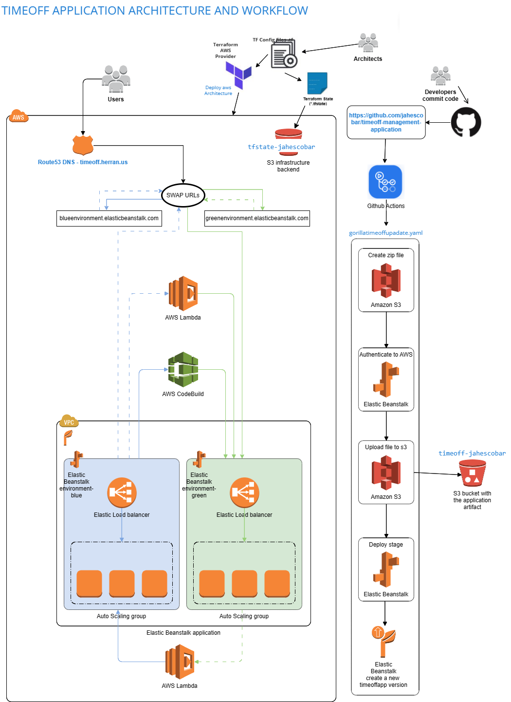

# Terraform code to deploy an Elastic Beanstalk environment for running nodejs 14 applications
There are two folders:
```
elasticbean/
standard/
```
The first one provisions:a vpc, subnets and deploy the elastic beanstalk environment in load balancer mode by default (FINAL ARCHITECTURE).

The second provisions a: a vpc, subnets, load balancer, nat gateway, internet gateway, 2 load balanced instances a route 53 entry with a cerfiticate associated to it

## Prerequisites

- Terraform installed on your system (> v0.12)
- Awscli configured with credentials and access to aws account

## Proceed with creation of a backend for your aws account inside the elasticbean folder

```
terraform {
  backend "s3" {
    bucket = "XXXXXXXX"
    key    = "xxxx/terraform.tfstate"
    region = "xxxxx"
  }
}
```

## Then execute:

```
- terraform init
- terraform apply --auto-approve
```

## Requirements

No requirements.


## Providers

| Name | Version |
|------|---------|
| <a name="provider_aws"></a> [aws](#provider\_aws) | 4.52.0 |

## Modules

No modules.

## Resources


| Name | Type |
|------|------|
| [aws_elastic_beanstalk_application.ebapp](https://registry.terraform.io/providers/hashicorp/aws/latest/docs/resources/elastic_beanstalk_application) | resource |
| [aws_elastic_beanstalk_application_version.default](https://registry.terraform.io/providers/hashicorp/aws/latest/docs/resources/elastic_beanstalk_application_version) | resource |
| [aws_elastic_beanstalk_environment.ebenv](https://registry.terraform.io/providers/hashicorp/aws/latest/docs/resources/elastic_beanstalk_environment) | resource |
| [aws_iam_instance_profile.ebec2profile](https://registry.terraform.io/providers/hashicorp/aws/latest/docs/resources/iam_instance_profile) | resource |
| [aws_iam_instance_profile.ebserviceprofile](https://registry.terraform.io/providers/hashicorp/aws/latest/docs/resources/iam_instance_profile) | resource |
| [aws_iam_policy_attachment.ebec2webpa](https://registry.terraform.io/providers/hashicorp/aws/latest/docs/resources/iam_policy_attachment) | resource |
| [aws_iam_policy_attachment.ebservicehealthpa](https://registry.terraform.io/providers/hashicorp/aws/latest/docs/resources/iam_policy_attachment) | resource |
| [aws_iam_policy_attachment.ebservicepa](https://registry.terraform.io/providers/hashicorp/aws/latest/docs/resources/iam_policy_attachment) | resource |
| [aws_iam_role.ebec2role](https://registry.terraform.io/providers/hashicorp/aws/latest/docs/resources/iam_role) | resource |
| [aws_iam_role.ebservicerole](https://registry.terraform.io/providers/hashicorp/aws/latest/docs/resources/iam_role) | resource |
| [aws_internet_gateway.ebigw](https://registry.terraform.io/providers/hashicorp/aws/latest/docs/resources/internet_gateway) | resource |
| [aws_network_acl.ebnacl](https://registry.terraform.io/providers/hashicorp/aws/latest/docs/resources/network_acl) | resource |
| [aws_route_table.ebrt](https://registry.terraform.io/providers/hashicorp/aws/latest/docs/resources/route_table) | resource |
| [aws_route_table_association.ebrta](https://registry.terraform.io/providers/hashicorp/aws/latest/docs/resources/route_table_association) | resource |
| [aws_route_table_association.ebrtb](https://registry.terraform.io/providers/hashicorp/aws/latest/docs/resources/route_table_association) | resource |
| [aws_s3_bucket.default](https://registry.terraform.io/providers/hashicorp/aws/latest/docs/resources/s3_bucket) | resource |
| [aws_s3_object.default](https://registry.terraform.io/providers/hashicorp/aws/latest/docs/resources/s3_object) | resource |
| [aws_subnet.ebsnpub1](https://registry.terraform.io/providers/hashicorp/aws/latest/docs/resources/subnet) | resource |
| [aws_subnet.ebsnpub2](https://registry.terraform.io/providers/hashicorp/aws/latest/docs/resources/subnet) | resource |
| [aws_vpc.ebvpc](https://registry.terraform.io/providers/hashicorp/aws/latest/docs/resources/vpc) | resource |

## Inputs

| Name | Description | Type | Default | Required |
|------|-------------|------|---------|:--------:|
| <a name="input_environment"></a> [environment](#input\_environment) | Environment of the solution | `string` | `"Production"` | no |
| <a name="input_owner"></a> [owner](#input\_owner) | Owner of the solution | `string` | `"jahescobar"` | no |

## Outputs

| Name | Description |
|------|-------------|
| <a name="output_dns_endpoint"></a> [dns\_endpoint](#output\_dns\_endpoint) | n/a |
| <a name="output_elastic_beanstalk_environment_cname"></a> [elastic\_beanstalk\_environment\_cname](#output\_elastic\_beanstalk\_environment\_cname) | Environment cname |


# This is the reference architecture

# To configure the continous delivery for the timeoff management application
Go to the repository: https://github.com/jahescobar/timeoff-management-application
There is the github action pipeline: https://github.com/jahescobar/timeoff-management-application/blob/master/.github/workflows/gorillatimeoffupdate.yaml

```
name: Gorillatimeoffupdate

on:
  push:
    branches: [ master ]

jobs:
  deploy:
    runs-on: ubuntu-latest

    steps:
      - uses: actions/checkout@v2

      - name: Create a ZIP deploy package
        run: zip -r timeoff_deploy.zip ./

      - name: Set AWS Credentials
        uses: aws-actions/configure-aws-credentials@v1
        with:
          aws-access-key-id: ${{ secrets.ACCESS_KEY_ID }}
          aws-secret-access-key: ${{ secrets.SECRET_ACCESS_KEY }}
          aws-region: "us-east-1"

      - name: Load deployment package to S3
        run: aws s3 cp timeoff_deploy.zip s3://timeoff-jahescobar/

      - name: Create a new timeoff-app Version
        run: |
          aws elasticbeanstalk create-application-version \
          --application-name timeoff-app \
          --source-bundle S3Bucket="timeoff-jahescobar",S3Key="timeoff_deploy.zip" \
          --version-label "timeoffapp-${{ github.sha }}" \
          --description "commit-sha-${{ github.sha }}"
      - name: Deploy new timeoff-app version
        run: aws elasticbeanstalk update-environment --environment-name timeoff-env --version-label "timeoffapp-${{ github.sha }}"
```

Which permits deploying the application from there to the infrastructure previously created with the code from this repository.

In order to adapt to your own environment, you need to setup the aws credentials in the secret setup of the github workflow, as well as modify it according to your application and S3 bucket setups. 

